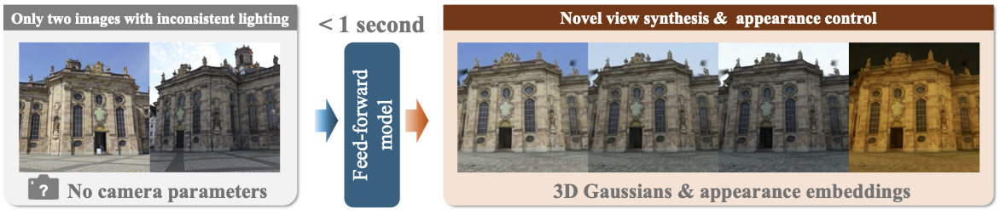

# WildSplatter



This repository provides the official PyTorch implementation of "**WildSplatter: Feed-forward 3D Gaussian Splatting with Appearance Control from Unconstrained Images**." 

[](https://arxiv.org/abs/2604.21182)

## Installation
Our code has been tested with CUDA 12.6. You can set up the environment as follows:
```
conda create -n wildsplatter python=3.10
conda activate wildsplatter

# Install PyTorch and xformers
pip install torch==2.9.1 torchvision==0.24.1 --index-url https://download.pytorch.org/whl/cu126
pip install xformers==0.0.33.post2

# Other dependencies
pip install -r requirements.txt
pip install --no-build-isolation git+https://github.com/nerfstudio-project/gsplat.git@0b4dddf04cb687367602c01196913cde6a743d70
```

## Pretrained model
You can download the pretrained checkpoint from the following link:

[[Download from Hugging Face]](https://huggingface.co/yfujimura/WildSplatter/resolve/main/wild_splatter.ckpt)

## View and appearance interpolation
We provide a script that takes two input views and interpolates both the viewpoint and appearance.
Example images are available in the ```assets``` directory. To run the demo:
```
CUDA_VISIBLE_DEVICES=0 python -m src.app_interp
```

## Training

### Preparing the training dataset

#### 1. Download the MegaScenes dataset
We use the [MegaScenes dataset](https://github.com/MegaScenes/dataset) to train our model. Please follow the official download instructions. We assume the downloaded dataset has the following directory structure:
- ```MegaScenes/```
    -  ```databases/```
    -  ```images/```
    -  ```reconstruct/```

#### 2. Estimate monocular depths for all scenes
Next, estimate monocular depth maps for all scenes. We align the predicted depth maps to the COLMAP sparse points by estimating the scale and bias with RANSAC. The aligned depth maps are then used to compute coverage scores between images during view set generation. Run the following commands:
```
cd src/megascenes_tool

# Single-GPU for one sub scene directories (000)
python precompute_depths_da3.py \
  --root_dir /path/to/MegaScenes \
  --depth_root /path/to/depths \
  --i0_start 0 --i0_end 0 --batch_size 256

# Multi-GPU for all scenes (000-458)
torchrun --nproc_per_node=4 precompute_depths_da3.py \
  --root_dir /path/to/MegaScenes \
  --depth_root /path/to/depths \
  --i0_start 0 --i0_end 458 --batch_size 256
```

#### 3. Generate view sets for training
Finally, generate view sets with sufficient overlap for training by running:
```
# Make view sets for all scenes (000-458)
python make_viewsets.py \
  --root_dir/path/to/MegaScenes \
  --depth_root /path/to/depths \
  --i0_start 0 --i0_end 458 
```

### Training
To start training, run the following command. Make sure to edit ```configs/main.yaml``` to match your environment before training.
```
python -m src.main
```


## TODO
- [x] Release training script and dataset
- [ ] Release test script for NeRF-OSR

## Citation
If you find our work useful for your research, please consider citing:
```
@article{Fujimura_2026_WildSplatter,
    author    = {Fujimura, Yuki and Kushida, Takahiro and Kitano, Kazuya and Funatomi, Takuya and Mukaigawa, Yasuhiro},
    title     = {WildSplatter: Feed-forward 3D Gaussian Splatting with Appearance Control from Unconstrained Images},
    journal   = {arXiv preprint arXiv:2604.21182},
    year      = {2026}
}
```

## Acknowledgements
This repository builds upon the following excellent projects:
- [Depth Anything 3](https://github.com/ByteDance-Seed/Depth-Anything-3)
- [NoPoSplat](https://github.com/cvg/NoPoSplat)
- [pixelSplat](https://github.com/dcharatan/pixelsplat)
